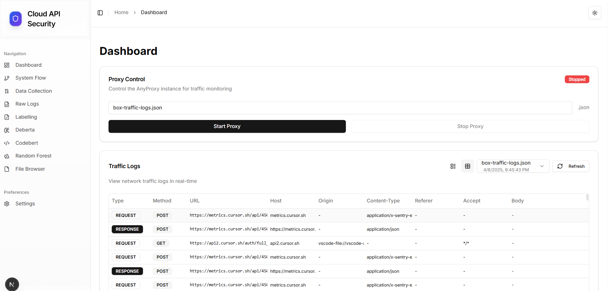
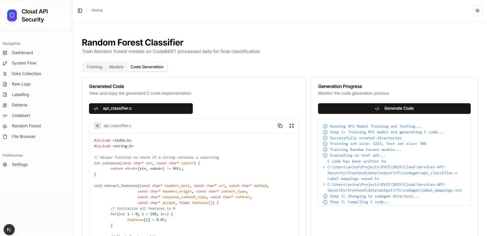

# Cloud Services API Security Analysis




## Project Structure
```
Cloud-Services-API-Security/
├── data-collection/           # Traffic capture components
│   ├── agent/                # Automated data collection
│   └── manual/              # Manual traffic capture
├── data/                    # Dataset storage
├── frontend/                # Next.js web application
│   ├── app/                 # Next.js App Router structure
│   ├── components/          # Reusable UI components
│   ├── public/              # Static assets
│   └── lib/                 # Utility functions and hooks
├── labelling/              # Initial labeling using GPT-4/Gemini
│   ├── labelling.py       # Main labeling script
├── zsl/                    # Zero-shot learning models
│   ├── codebert/          # CodeBERT-based classifier
│   │   ├── train.py       # Training pipeline
│   │   └── inference.py   # Inference with ZSL
│   └── deberta/           # DeBERTa-based classifier
│       └── inference.py   # Multilingual ZSL inference
└── rfc/                    # Random Forest training
```

## Project Overview

1. **Data Collection**: 
   - Automated agent for data collection
   - Manual proxy-based traffic capture
2. **Initial Labeling**: 
3. **Zero-Shot Learning**
4. **Training**: 
   - Random Forest Classifier on labeled data
5. **Frontend Application**:
   - Interactive dashboard
   - Data visualization
   - Model interaction

## Components

### 1. Data Collection (`/data-collection`)
Two approaches for gathering cloud service traffic:

#### a) Automated Agent
```bash
cd data-collection/agent
npm install
cp .env.example .env
npm run build && npm start
```

#### b) Manual Capture
```bash
cd data-collection/manual
anyproxy --port 8001 --rule general-json-key.js
```

### 2. Initial Labeling (`/labelling`)

#### Usage
```bash
cd labelling

# Set up environment
cp .env.example .env
# Add your API keys to .env:
# OPENAI_API_KEY=your_key
# GOOGLE_API_KEY=your_key

# Install dependencies
pip install -r requirements.txt

# Run labeling
python labelling.py
```

### 3. Zero-Shot Learning (`/zsl`)

#### CodeBERT Implementation


```bash
cd zsl/codebert

# Training
python train.py 

# Inference
python inference.py 
```


#### DeBERTa Implementation

```bash
cd zsl/deberta
python inference.py 
```
### 4. Random Forest Training (`/rfc`)
#### Usage
```bash
cd rfc

# Install dependencies
pip install -r requirements.txt

# Train model
python train.py 
```

### 5. Frontend Application (`/frontend`)
Modern Next.js application with interactive UI for the entire pipeline.

#### Features
- Interactive dashboard with model visualizations
- File browser and viewer (excluding CSV files)
- Workflow animations and pipeline visualization

#### Installation
```bash
cd frontend

# Install dependencies
npm install

# Run the development server
npm run dev
```

Open [http://localhost:3000](http://localhost:3000) to see the application.

#### Key Pages
- **Dashboard**: Main metrics and visualization
- **Data Collection**: Interface for AnyProxy
- **DeBERTa/CodeBERT**: Model visualization interfaces
- **RFC Generation**: Random Forest results
- **Files**: File browser and management

## Installation

1. Clone the repository:
```bash
git clone https://github.com/CubeStar1/Cloud-Services-API-Security.git
cd Cloud-Services-API-Security
```

2. Install Python dependencies:
```bash
pip install -r requirements.txt
```

3. Set up Node.js components:
```bash
cd data-collection/agent
npm install

cd ../../frontend
npm install
```

4. Install AnyProxy:
```bash
npm install -g anyproxy
```

## Configuration and Workflow

### 1. Data Collection
- Configure services in `data-collection/agent/services.config.ts`
  - Define cloud services to monitor
  - Set up authentication credentials
- Set up proxy rules in `data-collection/manual/general-json-key.js`
  - Define traffic capture patterns

Purpose: Gather raw HTTP traffic data from various cloud services through automated and manual methods.

### 2. Initial Labeling (Training Data Generation)
- Configure API keys in `labelling/.env`:
  ```
  OPENAI_API_KEY=your_key
  GOOGLE_API_KEY=your_key
  ```
- Adjust settings in `labelling/labelling.py`:
  ```python
  CONFIG = {
      'batch_size': 10,
      'use_openai': True  # Toggle between OpenAI/Gemini
  }
  ```

Purpose: Generate initial labeled dataset using GPT-4/Gemini to train the CodeBERT model.

### 3. Zero-Shot Learning
Run both models on unlabeled traffic data:

#### a) CodeBERT
```bash
cd zsl/codebert
python inference.py 
```

#### b) DeBERTa
```bash
cd zsl/deberta
python inference.py 
```

Purpose: Generate high-confidence predictions for both known and unknown patterns in the traffic data.

### 4. Random Forest Training
Configure in `rfc/train.py`:
```python
# Data processing
features = [
    'headers_Host',
    'url',
    'method',
    'requestHeaders_Content_Type',
    # ... other features
]
```

Purpose: Train the final classifier using the combined predictions from CodeBERT and DeBERTa for service and activity classification.

### 5. Frontend Application
Start the interactive frontend application:

```bash
cd frontend
npm run dev
```

Purpose: Provide a centralized interface for monitoring the entire pipeline, visualizing results, and managing files.

## Complete Workflow

1. Collect API traffic data using AnyProxy
2. Process and label initial data with GPT-4/Gemini
3. Apply zero-shot learning with DeBERTa and CodeBERT
4. Train Random Forest classifier on labeled data
5. View results and manage files through the frontend application

## Technologies Used

- **Backend**: Python, AnyProxy
- **Models**: DeBERTa, CodeBERT, Random Forest
- **Frontend**: Next.js, React, TypeScript, Tailwind CSS
- **APIs**: Google Gemini


